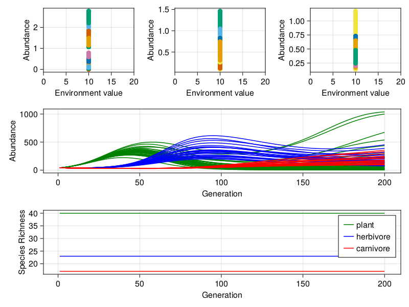

# Omnomnomivores

## More debugging...

So seems there is some sort of burnin, then heating, followed by a 'cooling'
phase. I _seems_ as if the environment is kept constant for the burnin and then
gradually 'heated' during the heating phase i.e. heterogeneity is introduced.
The cooling phase then allows the communities to reach some form of equilibrium.

So lets look at the 'burnin' phase. Here the environment value is set to 10 and so is the environ optimum for all species:

Yay we finally have a dynamical community!!

