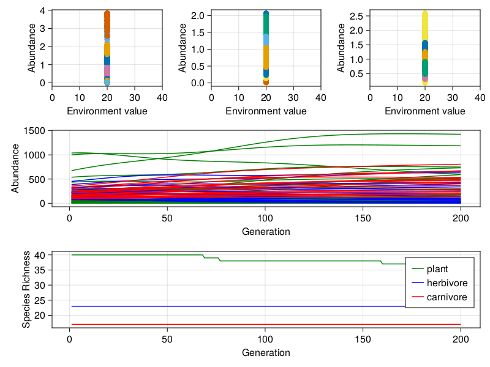
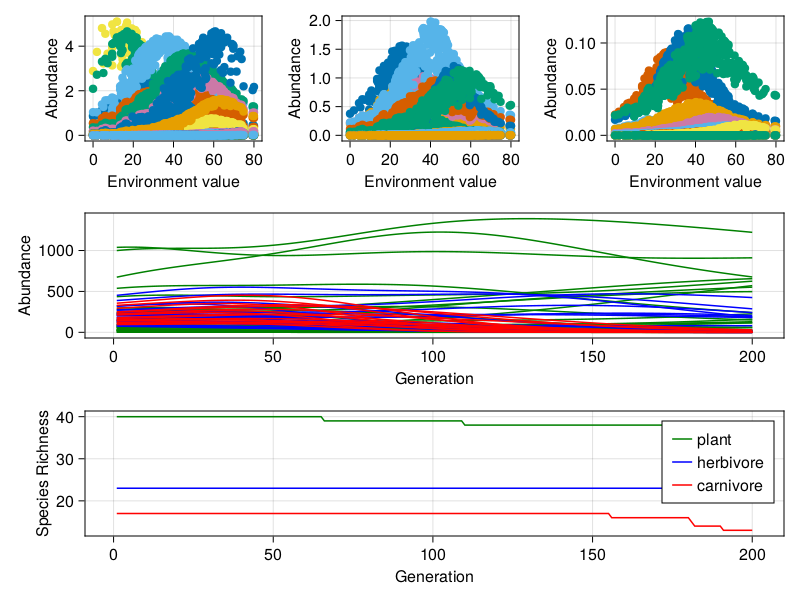

# Omnomnomivores

## More debugging...

So seems there is some sort of burnin, then heating, followed by a 'cooling'
phase. I _seems_ as if the environment is kept constant for the burnin and then
gradually 'heated' during the heating phase i.e. heterogeneity is introduced.
The cooling phase then allows the communities to reach some form of equilibrium.

So lets look at the 'burnin' phase. Here the environment value is set to 10 and so is the environ optimum for all species:

Yay we finally have a dynamical community!!

### Heating run 1

Okay so for this first run we will do two things for each generation/timestamp.
we 'heat' the landscape by the same value at each time step (can warm or cool in
reality) and also 'reset' the environmental optimum of each species based on the
new environmental ranges. This means each species will 'acclimate' as the
environment gets heated. A quick note on how the heating increments are
calculated - a 'final landscape' is set using `NeutralLandscapes` and the
difference between final and initial is calculated, divided by the number of
warming generations and that value is used as the increment value.

This is the result:

**FML...**

### Heating run 2

For interest I am going to shift the environment only once and keep it
uniform...

### Dance break

The previous result sort of points to the role of environment. Now maybe there
are two reason for this. One (1) is that we maybe need to change the environment
over a larger interval as opposed to every time step i.e. have a series of mini
burn ins. However I think the more logical reason is that there is a
disproportionate effect be the environment when a species is not at its
optimum...

**LIES***