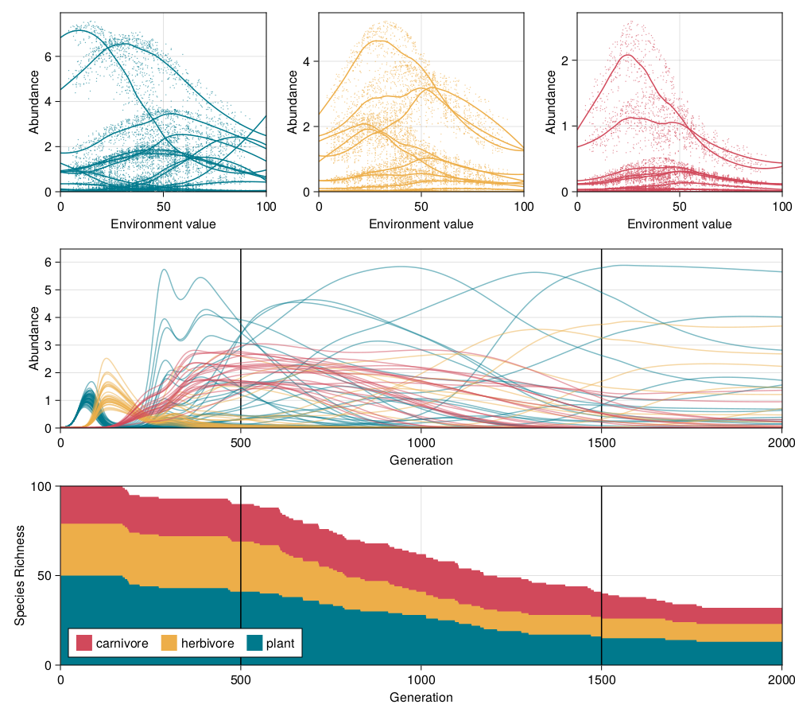
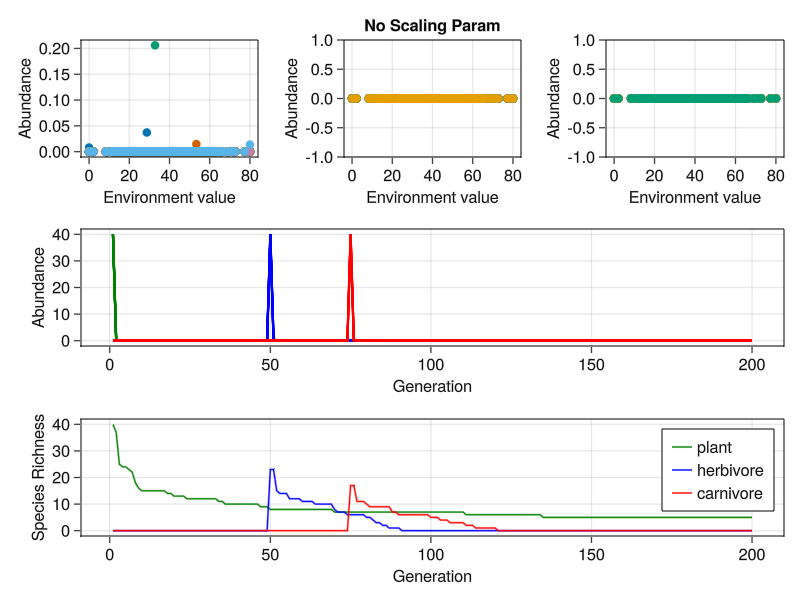
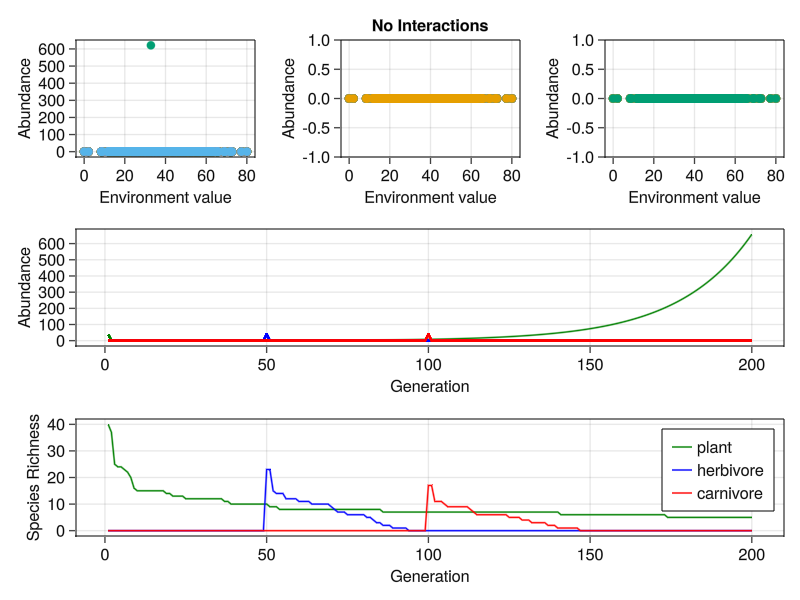
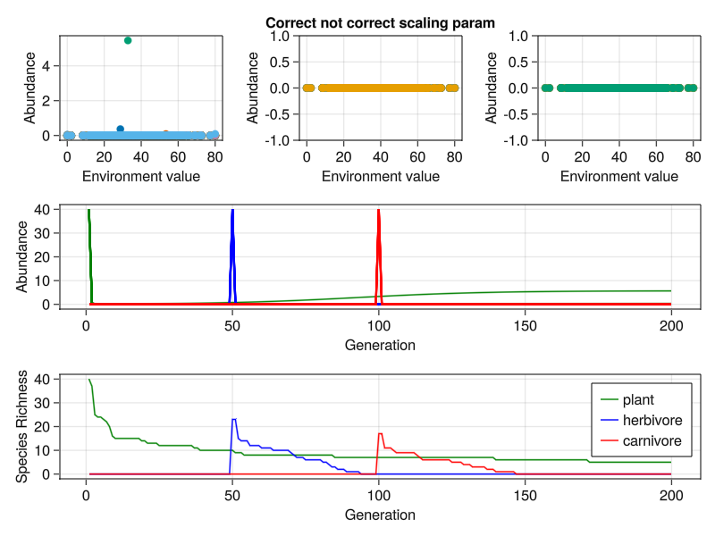
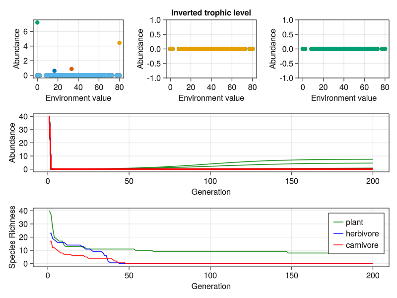

# Omnomnomivores

## Community Dynamics Just aren't a Vibe...

When we use the (what is hopefully) a carbon copy of the original T&G model the
abundances for species are just weird and seems to be a plant safe space as they
are the only species to persist. See below:

### Test 1: Set all but plant-plant interactions to zero

Here all interactions are zero-ed except for plant-plant interactions. If the
non-plants don't persist as long then it means that they were previously at
least getting _some_ sustenance but now none and then star to death (Alexa thats
so sad play Despacito).

Dynamics (shape-wise seem pretty unchanged) so they were previously starving to
death already???

### Test 2: Lets ramp up the strength of interactions

Lets start by setting the scaling parameter to zero.

I did this by multiplying the interaction values by (0.33*S) since that should
neutralise the original division term, in theory...

> Note I did something naughty and (for this test only) made the time between
> herbivore and carnivore invasion smaller so that carnivores invade while there
> are still herbivores in the system. No effect

### Test 3: Set all interactions to zero

One last hail mary before we try and throw parameters at the problem. Lets set
_ALL_ interactions to zero and see what happens to the plants.

Things seem to be pointing to growth maybe?

### Test 4: The test that should've been the first test

Double, triple, etc. check that the correct values are used for assigning
interaction strengths...

Looking at the source code for T&G some interesting notes.

- The seem to have an 'upside down trophic structure' in the sense that they
  have 5 'plants', 7 'herbivores', and 11 'carnivores'
- All intraspecific interactions are set to 0.2 (all trophic levels)
- Regarding previous it seems they then 'reset' 'carnivore' intraspecific
  interactions to 0.15
- weight is defines as '1/80*3' and 80 = S (since there should be 80 species)
  BUT when constructing the food web based on the numbers given on the first
  food web there are only 23 species...  
- Adding to the previous point nSpecies is set to 30...

What is life???

### Test 5: Lets try scaling of 1/80*3

Since this (1/80*3) is the scaling factor used lets give it a try...

So the interaction strength numbers 'match' those from T&G script for what thats
worth...

### Test 6: Set all initial abundances for same time

Set all initial abundances for all trophic levels for the first timestamp (no
community assembly)

### Test 7: Invert the trophic level

Lets invert the number of species at the different trophic levels.

I mean they persist a bit longer. And also plants are still persisting so it is
for sure the internal growth rate of the non plants at this point?

### Test 8: Inverted and gradual invasion

Lets go with the inverted trophic level but re-introduce gradual invasions.

Nope!

I hate this...

### Test 9: The why tf not option

I'm going to set all dispersal metrics (decay and distance) to zero and see if
that decided to really mess up the dynamics...

There is after all a trophic-level dependence on the 'dispersal decay'...

> Note I am going to use the 'correctly' scaled interaction values from test 5.

Blessed be the fruit!

### Test 10: Lets do without dispersal but keep decay

Since there seems to at least be some 'signal' lets play around with the
immigrations parameters. In this case we will keep the dispersal decay (which is
determined by trophic level) but keep dispersal rate constant.

> Note to self I should probably have double checked things regarding dispersal
> decay in the source code but my brain does not have the current capacity for
> that.

## (cracks knuckles) Lets play with dispersal decay (big L)

Since 'removing' dispersal parameters seems to give us 'normal' dynamics it
seems that at least of the problems rests on its shoulders. So lets have a look

### Test 11: Same dispersal decay for all trophic levels

Let's see if setting the dispersal rate independent of trophic level. For this
trial I'll use the distribution that we used for plants since it seems the most
'normal'. One would hope to see the other trophic levels behave somewhat
normally (i.e. not go completely extinct)...

### Test 12: I need to refresh my brain and have a model where we have a dispersal rate (a) but not decay (L)

Basically this gives us a litmus test of i/emigration because setting rate to
zero zeros both i/emigration. I will use the dispersal rates from the OG
simulations.

Okay yeah I think this implies that dispersal decay is maybe not to blame??
Since this looks quite similar to the OG simulations? Here OG being test five
since we are now using the 'correct' scaling...

### Test 13: Set dispersal rate to 1

By setting the dispersal rate to one (1) it should have no impact on the other
parameters since it is always multiplied in. Setting it to zero removes both
immigration and emigration terms.

Okay, yeah all I can really glean from this is that it has to do with
immigration and emigration rates and how those ratio?? Because if we set both to
zero (or even decay rate to zero which leads to a de-facto zero) we get the most
normal looking community dynamics.

### Test 14: Resort to the source code

Might still be worth following up on this in the source code to be sure were
using the correct decay rates for the trophic levels...

### Test 15: Teenier than tiny decay rate

It seems that we are correct on the side of the maths so lets see what happens
if we make the rate of decay teenier than tiny (0.001) for funsies.

Okay yeah for sure its that there in and out ratio thats been giving us the
runaround...

> cc to Tim for this gem

