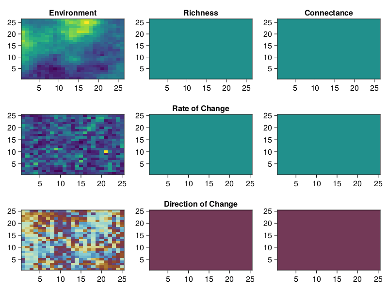

# Omnomnomivores

The code associated with this repository is essentially taking the metacommunity
model from [Thompson and Gonzalez
2017](https://doi.org/10.1038/s41559-023-02163-0) and adding some modification
to the workflow to suit the specific research goals/questions. A high-level
visual summary of the model itself can be found below:

As for the research aims the idea is to use wombling to look at the rates of
change of networks/communities over varying degrees of landscape connectivity
and environmental effect. Essentially delivering us with a figure that looks
like this:

## REPO STRUCTURE

Code associated with the metacommunity model can be found in `lib/`.

`01_code.jl` is where the process of generating the metacommunites can be found. This includes a 'proofing' (burnin, neutral landscape), baking (heating phase where landscape and environmental values are gradually changed), and cooling (where the final 'state' is kept dteady to allow community dynamic to 'settle')

`02_boundaries.jl` (which should probably be renamed) is where the wombling part of the project can be found.